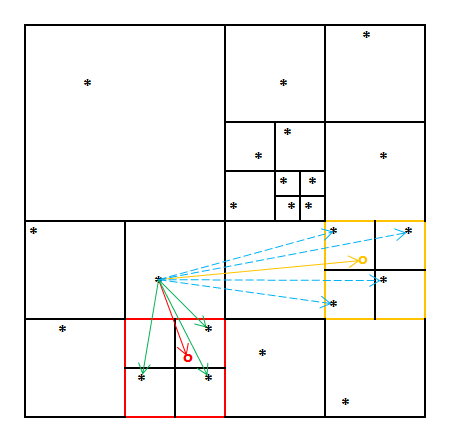

## Barnes-Hut (https://iss.oden.utexas.edu/?p=projects/galois/scientific/barnes_hut)

### Application Description

This benchmark simulates the gravitational forces acting on a galactic cluster using the Barnes-Hut n-body algorithm [1]. The positions and velocities of the n galaxies are initialized according to the empirical Plummer model. The program calculates the motion of each galaxy through space for a number of time steps. The data parallelism in this algorithm arises primarily from the independent force calculations.

[1] J. Barnes and P. Hut. A hierarchical O(N log N) force-calculation algorithm. Nature, 324(4):446-449, December 1986.

### Algorithm

Barnes-Hut's force-calculation algorithm employs a hierarchical data structure, called an octree, to approximately compute the force (e.g., gravitational, electric, or magnetic force) that the n bodies in the system induce upon each other. With n bodies, O(n2) interactions need to be considered, i.e., the precise calculation is quadratic in the number of bodies. The Barnes-Hut algorithm hierarchically partitions the volume around the n bodies into successively smaller cells. Each cell forms an internal node of the octree and summarizes information about the bodies it contains, in particular their combined mass and center of gravity. The leaves of the octree are the individual bodies. This hierarchy reduces the time to calculate the force on the n bodies to O(n log n) because, for cells that are sufficiently far away, it suffices to perform only one force calculation with the cell instead of performing one calculation with each body inside the cell. For example, consider the two-dimensional hierarchical subdivision of space in Figure 1. Sometime during the force calculation of the galaxy that is the source of the arrows, the algorithm will check whether the red cell's center of gravity (red circle) is far enough away. Because it is not, the code proceeds to look at all subcells and performs the force calculations marked by the green arrows. When the algorithm considers the orange cell, however, it will find that this cell is sufficiently far away and will therefore only perform one force calculation (orange arrow) and will not look deeper into this cell (blue arrows).

<p align="center">
  
</p>  
<p align="center">
  <strong>Figure 1: Hierarchical force calculation example.</strong>
</p>

In more detail, the algorithm proceeds as follows (pseudocode is provided in Figure 2). First, the set of bodies is initialized with the starting location and velocity of each body (line 1). Then the code iterates over the time steps (line 2). In each iteration, a new octree (i.e., spatial hierarchy) is generated by inserting all bodies (lines 3-5). Then the cumulative mass and center of mass of each cell is recursively computed (line 6). Next, the force acting upon each body is computed (lines 7-8) by traversing the octree. The traversal along any path is terminated as soon as a leaf node (i.e., a body) or an internal node (i.e., a cell) that is far enough away is encountered. Finally, each body's position and velocity are updated based on the computed force (lines 9-10).


```c
1  Set bodies = /* read input */;
2  for (int step = 0; step < maxTimestep; step++) {
3    Octree octree = new Octree();
4    for (Body b : bodies) {
5      octree.Insert(b);
6      octree.SummarizeSubtrees();
7      for (Body b : bodies) {
8        b.ComputeForce(octree);
9        for (Body b : bodies) {
10         b.Advance();
11       }
12     }
13   }
14 }
```

<p align="center">
  <strong>Figure 2: Pseudocode for Barnes-Hut</strong>
</p>

### Data Structures

There are two key data structures used in Barnes-Hut:

#### Unordered set

The bodies are stored in an unordered set as they can be processed in any order. Once initialized, the set does not change. Only the bodies' attributes are modified in each time step.

#### Octree

The spatial hierarchy is represented by an octree (the 3-dimensional equivalent of a binary tree), where each node has up to eight children. The leaves of the octree correspond to individual bodies whereas the internal nodes represent the cells.

### Parallelism
While many phases of Barnes-Hut can be parallelized (including building the octree and calculating the summary information), we focus on parallelizing the force-computation step, which consumes the vast majority of the runtime. The active nodes in this step are the bodies. Calculating the force on each body requires reading some portion of the octree, so the accessed nodes form the body's neighborhood. Because these accesses are read-only, the bodies can be processed in any order and in parallel, provided that a body does not update its position or velocity until all force computations are complete. For data locality reasons, it may be beneficial to process spatially close bodies together.
